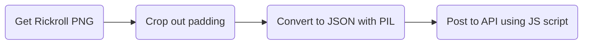

# Rick Canvas

This automates placing a RickRoll QR code on the [Aggie Canvas](https://aggiecanvas.linux.usu.edu/) using their REST API. I made this on a lunch break [using ChatGPT](https://chat.openai.com/share/7c1980d5-e891-4d28-95b3-3abb11861ca0) and by hacking together the plumbing, so the code is Not Great™. That being said, if you'd like to see how this was done, the pipeline was:

ChatGPT wrote the Python PIL script to convert the image to JSON, I modified it to sample centers of squares instead of checking any pixel (it was getting the borders of regions and incorrectly converting), then once again used GPT to generate the code to properly call the API. The API shape was deduced from network information in Firefox inspector.

I finished by writing a basic 2D `for` loop to make the calls, added some retry logic, and made sure that each request only happens every 2.5s so that it doesn't spam the server (requests have a 2 second cooldown anyways).

# Why?

It's fun :3

Also, whoever did this first won a $10 donation to their open source project of choice. I chose the [Learning Equality](https://learningequality.org/donate/) project, who prioritizes offline-first content management systems for educational courses. If you haven't, check out their Kolibri software and the available courses you can download for it.
